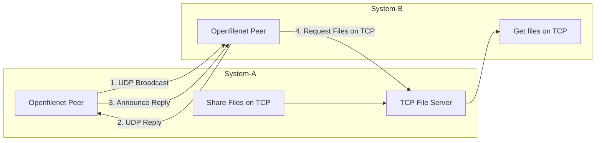

# OpenFilenet

**Author:** Vamsi Karnam

**License:** Apache License 2.0

*“ Openfilenet is an open-source, modern, LAN-native, cross-platform, P2P file share for real programming workflows - developed and maintained by [Vamsi Karnam](https://www.linkedin.com/in/saivamsikarnam/) - Distributed file access made stupidly simple.”*

---

**OpenFilenet**  lets your code access files on other machines **as if they were local**, using a tiny, dependency-free P2P protocol (optionally secured with AES-256-GCM) using a lightweight, zero-config **peer-to-peer file sharing API** designed for **code runtimes** to be as developer friendly as possible.

Forget SMB, SFTP, FTP, SCP, HTTP file servers, shared folders, or network mounts. Openfilenet abstracts away the file share protocol and makes it super easy to implement.

**Features:**
* Works over local networks / Wi-Fi / Ethernet / VPN
* Cross-platform (Windows, Linux, macOS, Raspberry Pi)
* No servers, no Daemons, no config files
* File fetching in *memory* (no need to write temp files)
* Async discovery via UDP broadcast
* Encrypted transfer option
* Ideal for ML pipelines, sensors, robotics, distributed data collection, edge devices, experiments
* Simple API: `share_files`, `list_files`, `get_file`, `add_peer`

- OpenFilenet abstracts away networking so *your code* can access remote files with zero overhead.

---

## Table of contents

* [Intro & description](#openfilenet)
* [Architecture](#architecture)
* [Core modules](#openfilenet-modules)
* [Framework](#framework)
* [Encryption](#encryption-aes-256-gcm)
* [Language Support](#language-support)
* [Installation](#installation)
* [Requirements](#requirements)
* [Example applications](#example-applications)
* [License / Author / Contact](#license--author--contact--citation)
* [Appendix](#appendix)

---

## Architecture


---

## Openfilenet Modules
For modules see [function reference doc](https://github.com/vamsi-karnam/openfilenet/tree/main/docs)

---


## Framework

OpenFilenet uses a **true peer-to-peer model**. Every instance is both:

1. **A broadcast server** (UDP discovery)
2. **A file server** (TCP file provider)
3. **A file client** (TCP file consumer)

### 1. Discovery (broadcast)

**Description**: Every peer periodically (*default: every 1 sec*) broadcasts a packet over UDP:
**Default protocol**: UDP
**Default port**: 51230

```json
{
  "type": "announce",
  "token": "<token>",
  "peer_id": "...",
  "port": <tcp_port>
}
```
- Any peers listening on the same UDP port receive this broadcast and record the (IP addr, TCP port) of the sender.

> Sometimes discovery can be asymmetric (e.g., some routers drop broadcast packets), OpenFilenet sends “***unicast announce replies***” so both sides learn about each other. The function `add_peer()` exists as a fallback for unusual networks.

### 2. File Index

**Description**: A peer who wants to share the files/directory calls:
```python
share_files("/path/to/myfile.txt")
share_files("/path/to/myfolder")
share_files(["/path/to/a", "/path/to/b"])
```
- OpenFilenet can share a single file or recursively index all files in the directory.
- Other peers can retrieve this index via `list_files()`.

### 3. File Transfer

**Description**: A peer who wants to get the shared files/directory listing calls:
```python
list_files() # to list all files being served by all peers using the same token
get_file(peer_id, path)
```
**Default protocol**: TCP
**Default port**: Ephemeral/Random

- Requests the file to download.
- Receives plaintext or AES-256-GCM encrypted bytes.

This enables processing remote files in-memory without saving to local disk.

---

## Encryption (AES-256-GCM)

OpenFilenet includes optional encryption using the industry-standard AEAD cipher suite:

* **AES-256-GCM**
* 12-byte random nonce
* Authenticated Additional Data (AAD) = token
* Integrity-protected ciphertext

### How to enable:

```python
openfilenet.encrypt = True
openfilenet.key = "my_secret_key"
```

In the background:

* `key` → SHA-256 → 32-byte AES key.
* A random nonce is generated per file: `os.urandom(12)`.
* File bytes are encrypted fully into memory and then sent.

If `encrypt=True`, both peers *must* set the **same key**.

Encryption affects only file transfer, not UDP discovery or metadata.

---


## Language support

| Language | Status      |
| -------- | ----------- |
| Python   | Implemented |
| C        | Planned     |
| C++      | Planned     |

---

## Installation

### Option 1 - PyPI release (recommended usage)

```bash
pip install openfilenet
```

### Option 2 - Local clone (recommended for testing and development)

```bash
git clone https://github.com/vamsi-karnam/openfilenet.git
cd openfilenet
pip install -r requirements.txt
```

### Requirements

Only required **if encryption is enabled**:

```
cryptography
```

If you don't use encryption, OpenFilenet has **zero external dependencies**.

---

## Example applications

* Distributed ML dataset sharing without NFS/Samba.
* Python workers processing remote sensor logs.
* Raspberry Pi cluster exchanging data dynamically.
* Local LLM workers sharing checkpoints.
* “Ad-hoc cluster mode” for laptops on a network.
* Edge AI pipelines that pass data P2P.

---

## License / Author / Contact / Citation

OpenFilenet
Developed by **Vamsi Karnam**, 2025.  
Released under the **Apache 2.0 License**.

If you use this software in any of your works, please cite:
> Karnam, S. V. (2025). *Openfilenet: an open-source, modern, LAN-native, cross-platform, P2P file sharing for real programming workflows. *

For contact, collaborations, bug reports, or business, reach out via saivamsi.karnam@gmail.com.

Author Social: [LinkedIn](https://www.linkedin.com/in/saivamsikarnam/)

OpenFilenet is open-source and contributions are welcome.

---

# Appendix

## Usage examples

Usecase: Run openfilenet to share, and receive and process across two peers connected over LAN.

### Peer 1
1. Install openfilenet

```python
pip install openfilenet
```

2. Example peer_share.py

```python
"""
Peer A: Share a local CSV file via OpenFilenet to all the peers.
"""
import time
import openfilenet as ofn

# -------------------------------------------------------------------
# openfilenet configuration
# -------------------------------------------------------------------
# Room / namespace. All peers in this room / namespace can see each other on the network.
ofn.token = "demo"

# Optional: Enable debug
# ofn.debug = True

# Optional: override UDP discovery port (default: 51230)
# ofn.port.udp_discovery = 51230

# Optional: force a specific TCP server port (default: 0 = OS chooses)
# ofn.port.tcp_server = 50000

# Optional: enable AES256 encryption (AES-256-GCM) for get_file() transfers
# If you enable this, all peers must set the SAME key and have the `cryptography` package installed.
ofn.encrypt = True
ofn.key = "secret"

# -------------------------------------------------------------------
# Share a file or directory on the P2P network
# -------------------------------------------------------------------
# Change this to the absolute or relative path of file or directory.
CSV_PATH = "path/to/your/dir/or/file"  # e.g. on windows "C:\\Users\\username\\data\\my_data.csv"

ofn.share_files(CSV_PATH)

print(f"Sharing CSV file: {CSV_PATH}")
print("Peers using the same token: ", ofn.token," can now discover and fetch the shared file(s).")
print("Press Ctrl+C to exit.")

# Keep the process alive so the TCP server and discovery keep running
while True:
    time.sleep(10)
```

### Peer 2
1. Install openfilenet

```python
pip install openfilenet
```

2. Example peer_receive.py

```python
"""
Peer B: Discover a remote CSV file via OpenFilenet and process it in memory.
"""

import time
import io
import csv
from pathlib import Path

import openfilenet as ofn

# ---------------------------------------------------------------------------
# openfilenet configuration
# ---------------------------------------------------------------------------

# Must match the token used on the sharing peer.
ofn.token = "demo"

# Enable debug logs to see discovery and connections.
# ofn.debug = True

# Optional: enable encryption (must match sharer if used).
ofn.encrypt = True
ofn.key = "secret"


# ---------------------------------------------------------------------------
# Wait for files to appear on the P2P network
# ---------------------------------------------------------------------------

def wait_for_remote_files(timeout_seconds: int = 10, poll_interval: float = 1.0):
    """
    Poll openfilenet.list_files() until we see at least one file
    or until timeout is reached.

    Discovery is asynchronous, so this ensures we see peers that come online.
    """
    start = time.time()
    while time.time() - start < timeout_seconds:
        files = ofn.list_files()
        if files:
            return files
        print("No remote files yet, waiting...")
        time.sleep(poll_interval)
    return []


print("Looking for remote files...")

files = wait_for_remote_files(timeout_seconds=10)

if not files:
    print(
        "No remote files found."
        f"Is the sharing peer running and using token {ofn.token!r}?"
    )
    raise SystemExit

print("\nDiscovered remote files:")
for f in files:
    print(f'  peer={f["peer_id"]}  path={f["path"]}  size={f["size"]}')
print()


# ---------------------------------------------------------------------------
# Fetch and process the file (CSV) in memory
# ---------------------------------------------------------------------------

# fetch the file the sharer is exposing. (use a loop for multiple files)
fmeta = files[0]
peer_id = fmeta["peer_id"]
remote_path = fmeta["path"]

print(f"Fetching remote CSV from peer={peer_id} path={remote_path}")

# Get file bytes IN MEMORY (no temp files).
data = ofn.get_file(peer_id, remote_path)  # dest=None => returns bytes

# Decode bytes into text (UTF-8 is common for CSV).
text = data.decode("utf-8", errors="replace")

# Parse CSV using Python's built-in CSV reader.
buf = io.StringIO(text)
reader = csv.reader(buf)

try:
    header = next(reader)   # first row = column names
except StopIteration:
    print("The CSV file appears to be empty.")
    raise SystemExit

# Count remaining rows
row_count = sum(1 for _ in reader)

print("\nCSV metadata:")
print(f"  Columns ({len(header)}): {header}")
print(f"  Rows: {row_count}")
print(f"  Dimensions: {row_count} rows × {len(header)} columns\n")


# ---------------------------------------------------------------------------
# Additionally plug in your own processing logic
# ---------------------------------------------------------------------------
# For example:
#   - load into pandas
#   - feed into a model
#   - compute statistics
#   - filter rows, etc.
#
# Example:
#
# import pandas as pd
# buf.seek(0)    # rewind to beginning
# df = pd.read_csv(buf)
# print(df.head())
```
---
> *"Data should empower, not overwhelm"*
